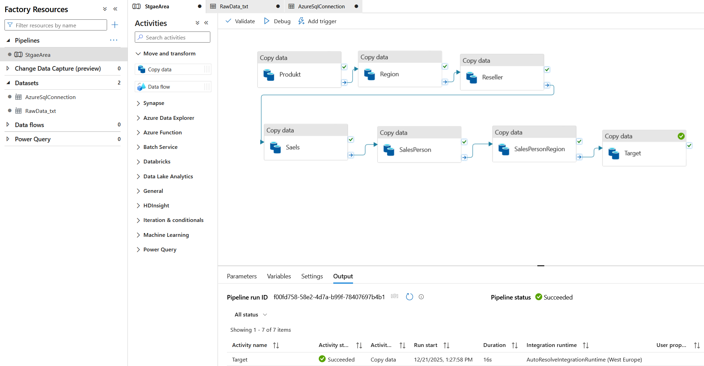
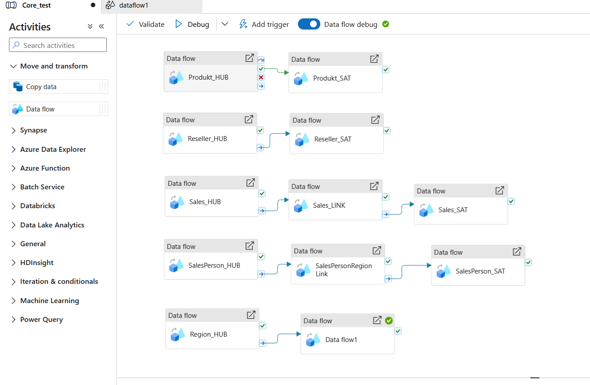
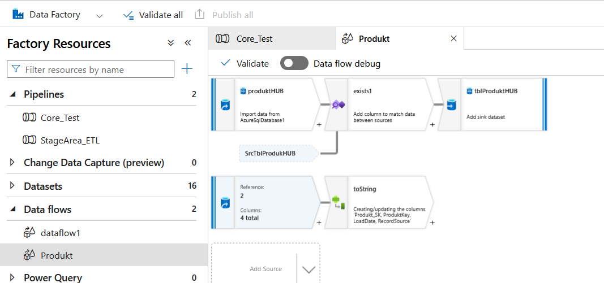

### Azure Data Factory Pipeline

Azure Data Factory is used to orchestrate the data movement and transformations
between the different layers of the data warehouse.

The pipelines load data into the Data Vault core (HUB, LINK, SAT tables) and
subsequently populate the Data Mart layer (dimension and fact tables).

Each pipeline is designed with a clear responsibility to ensure maintainability,
reusability, and cost efficiency.

## Azure Data Factory Copy Activities – Staging LayerArchitektur von Data Warehouse

 ## Azure Data Factory – Data Vault Core Orchestration
 

### ADF Mapping Data Flow – Produkt HUB Load

