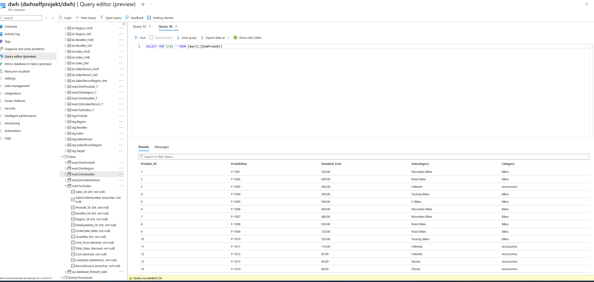
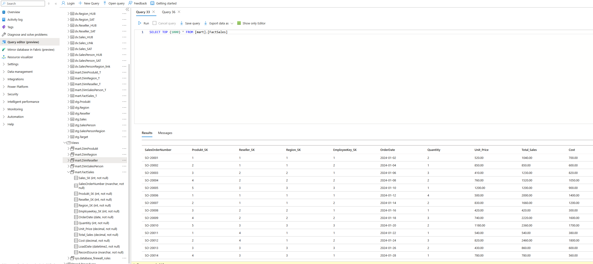

## Data Mart (Star Schema)

This section represents the **Data Mart layer** of the data warehouse,
modeled using a **star schema** and built on top of the Data Vault core.

The Data Mart is designed to support analytical queries by providing
denormalized, business-friendly structures.

## Components

## Dimension Tables (DIM_Product)
Dimension tables contain descriptive attributes that provide context for
analysis, such as products, regions, resellers, and salespersons.

Example attributes include:
- Product category and subcategory
- Geographic information
- Business partner details

Screenshots are provided to demonstrate the populated dimension tables.

## Fact Tables (FACT)
Fact tables store quantitative business measures such as:
- Sales quantity
- Revenue
- Cost

They reference the dimension tables via surrogate keys and represent
business events at a transactional grain.

Screenshots of the fact table data are included to illustrate realistic
analytical records.

## Purpose

The Data Mart simplifies access to data stored in the Data Vault and enables
efficient analysis using SQL or BI tools.
In this project, screenshots are used to demonstrate the correctness and
structure of the Data Mart layer.
